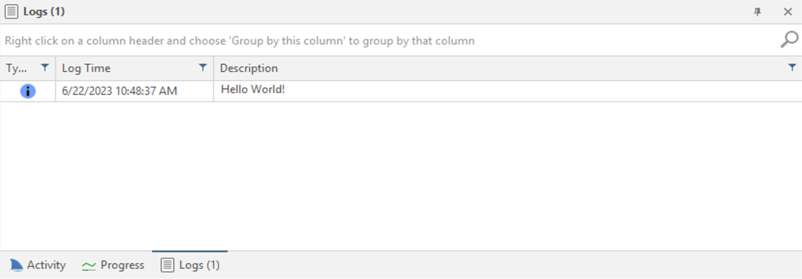

# Custom Security Checks API Reference

## Request Class

This represents an HTTP request. You can use this class to send HTTP requests to a web server and retrieve the responses.

> **Note**
> An HTTP request for each attack pattern specified in the script's ```attacks``` array has already been carried out by the scanner by the time the code in the ```analyze``` function runs. Use the ```Request``` class to perform any **extra** requests that you need to perform before raising a vulnerability (if required). Please see the overview documentation for each type of security checks.

### Create a Request Instance

The following example shows how to create a new instance of a ```Request``` class and use it:

```js
var request = new Request('https://example.com/');

var response = invicti.request(request);
```

### Request Class Properties

| Name | Type | Description |
|------|------|-------------|
| Aborted | [```Boolean```](https://developer.mozilla.org/en-US/docs/Web/JavaScript/Reference/Global_Objects/Boolean) | Gets a value indicating whether this Request is aborted. *(Read-only)* |
| Body | [```String```](https://developer.mozilla.org/en-US/docs/Web/JavaScript/Reference/Global_Objects/String) | Gets or sets the body of the HTTP request. |
| Headers | Dictionary | Gets a dictionary of HTTP request headers where you can add/update headers. Lookup is performed in a case sensitive way. |
| Method | [```String```](https://developer.mozilla.org/en-US/docs/Web/JavaScript/Reference/Global_Objects/String) | Gets or sets the HTTP method (verb) used in the request (e.g. GET, POST, PUT, DELETE). |
| Parameters | List | Gets a list of ```Parameter``` instances which are sent as part of the request. (e.g. Querystring, Post) |
| Uri |[```String```](https://developer.mozilla.org/en-US/docs/Web/JavaScript/Reference/Global_Objects/String) | Gets or sets the URI to perform the request to. |

### Request Class Methods

#### ```Abort()```

Aborts the request.

> **Note**
> This method can be used to abort requests while writing [Pre-Request Scripts
](https://www.invicti.com/support/prerequest-scripts/)

### How to perform a POST request

```js
var req = new Request('https://example.com/action');
req.Parameters.Add(new Parameter('foo', 'bar', ParameterType.Post));
var res = invicti.request(req);
```

### How to add custom request headers to a request

```js
var req = new Request('https://example.com/');
req.Headers.Add('X-CustomHeader', 'test');
var res = invicti.request(req);
```

### How to send a POST request with a JSON payload

```js
var req = new Request('https://example.com/');

req.Headers.Add('Content-Type', 'application/json');
req.Method = 'POST';
req.Body = '{ "foo" : { "bar" : 42 } }';

var res = invicti.request(req);
```

---

## Response Class

This represents an HTTP response. You can use the class to retrieve the responses to HTTP requests made by the invicti.

> **Note**
> ```Response``` class cannot be constructed, instances of this class are only returned by ```invicti.request``` and ```invicti.requestRaw``` method calls.

### Response Class Properties

| Name | Type | Description |
|------|------|-------------|
| Body | [```String```](https://developer.mozilla.org/en-US/docs/Web/JavaScript/Reference/Global_Objects/String) | Gets or sets the body of the HTTP response. *(Read-only)* |
| Headers | Dictionary | Gets a dictionary of HTTP response headers. Lookup is performed in a case sensitive way. |
| RawResponse | [```String```](https://developer.mozilla.org/en-US/docs/Web/JavaScript/Reference/Global_Objects/String) | Gets the raw HTTP response which consists of headers and body. *(Read-only)* |
| ResponseTime | [```Number```](https://developer.mozilla.org/en-US/docs/Web/JavaScript/Reference/Global_Objects/Number) | Gets the elapsed response time in milliseconds. *(Read-only)* |
| StatusCode | [```Number```](https://developer.mozilla.org/en-US/docs/Web/JavaScript/Reference/Global_Objects/Number) | Gets the HTTP response status code. (e.g. 200, 404) *(Read-only)* |
| StatusDescription |[```String```](https://developer.mozilla.org/en-US/docs/Web/JavaScript/Reference/Global_Objects/String) | Gets the HTTP response status description. (e.g. "OK", "Not Found") *(Read-only)* |
| Uri | [```String```](https://developer.mozilla.org/en-US/docs/Web/JavaScript/Reference/Global_Objects/String) | Gets the address that request is made to. *(Read-only)* |

### How to conditionally raise a new vulnerability by matching a regex pattern on response body

```js
var req = new Request('https://example.com/');
    
var res = invicti.request(req);

var regex = /java.io.FileNotFoundException/g;
var found = res.Body.match(regex);

if (found.length > 0) {
   return new Vulnerability(VulnerabilityType.ProgrammingErrorMessages);
}
```

---

## Parameter Class

This represents a HTTP request parameter and provides properties and methods for working with request parameters.

### Create a Parameter Instance

```Parameter``` class constructor takes 3 arguments:

| Name | Type | Description | Required |
|------|------|-------------|----------|
| name | [```String```](https://developer.mozilla.org/en-US/docs/Web/JavaScript/Reference/Global_Objects/String) | The name of the parameter. | Yes |
| value | [```String```](https://developer.mozilla.org/en-US/docs/Web/JavaScript/Reference/Global_Objects/String) | The value of the parameter. | Yes |
| type | ```ParameterType``` | The type of the parameter. (See list below) *(default: ParameterType.Querystring)* | No |

#### List of ```ParameterType``` values

| Name | Description |
|------|-------------|
| ```ParameterType.Querystring``` | Represents a query string (GET) parameter. |
| ```ParameterType.Post``` | Represents a request body (POST) parameter. |
| ```ParameterType.FullQueryString``` | Represents a full query String treated as one parameter. (e.g. /?full_query_string) |

The following example shows how to create a new instance of a ```Parameter``` class and use it:

```js
var request = new Request('https://example.com/');

var parameter = new Parameter("name", "value", ParameterType.Post);
request.Parameters.Add(parameter);

var response = invicti.request(request);
```

### Parameter Class Properties

| Name | Type | Description |
|------|------|-------------|
| Name | [```String```](https://developer.mozilla.org/en-US/docs/Web/JavaScript/Reference/Global_Objects/String) | Gets the name of the parameter. *(Read-only)* |
| Value | [```String```](https://developer.mozilla.org/en-US/docs/Web/JavaScript/Reference/Global_Objects/String) | Gets the value of the parameter. *(Read-only)* |
| Type | ```ParameterType``` | Gets the type of the parameter. (See list above) *(Read-only)* |

---

## Vulnerability Class

Represents a vulnerability detected with the scanner. You can raise vulnerabilities which can be a built-in type or a custom type. There are 4 overloads of the Vulnerability class constructor:

### ```Vulnerability(VulnerabilityType type)```

Creates a vulnerability with a built-in vulnerability type. (e.g. VulnerabilityType.Xss, VulnerabilityType.HstsNotEnabled). Please see "How to get built-in ```VulnerabilityType``` enum values" below to learn more.

```js
function analyze(context, response) {
   if (response.Body.indexOf('java.io.FileNotFoundException:') > -1) {
     return new Vulnerability(VulnerabilityType.ProgrammingErrorMessages);
   }
}
```

### ```Vulnerability(VulnerabilityType type, int certainty, bool confirmed)```

Creates a vulnerability with a built-in vulnerability type (e.g. VulnerabilityType.Xss, VulnerabilityType.HstsNotEnabled), the certainty percentage and confirmation status.

| Name | Type | Description | Required |
|------|------|-------------|----------|
| type | ```VulnerabilityType``` | The built-in ```VulnerabilityType``` enum member value. Please see "How to get built-in ```VulnerabilityType``` enum values" below to learn more. | Yes |
| certainty | [```Number```](https://developer.mozilla.org/en-US/docs/Web/JavaScript/Reference/Global_Objects/Number) | The certainty value of the vulnerability. Should be a number between 0 and 100. | Yes |
| confirmed | [```Boolean```](https://developer.mozilla.org/en-US/docs/Web/JavaScript/Reference/Global_Objects/Boolean) | Specifies whether this vulnerability is a possible finding or a confirmed finding. | Yes |

```js
function analyze(context, response) {
   if (response.Body.indexOf('java.io.FileNotFoundException:') > -1) {
     return new Vulnerability(VulnerabilityType.ProgrammingErrorMessages, 100, true);
   }
}
```

### How to get built-in ```VulnerabilityType``` enum values

You can find all built-in VulnerabilityType values by going over a new *Report Policy* on the product UI. You need to click **Edit** button when you select a vulnerability type on *Report Policy Editor* and note the **Type** value.

### ```Vulnerability(string guid)```

Creates a vulnerability with a custom vulnerability type. You need to create a custom vulnerability type on *Report Policy Editor* and use the generated GUID value.

```js
function analyze(context, response) {
   if (response.Body.indexOf('java.io.FileNotFoundException:') > -1) {
     return new Vulnerability('b7ead310-597c-4f96-baee-813bdda46794');
   }
}
```

### ```Vulnerability(string guid, int certainty, bool confirmed)```

Creates a vulnerability with a custom vulnerability type, the certainty percentage and confirmation status. You need to create a custom vulnerability type on *Report Policy Editor* and use the generated GUID value.

| Name | Type | Description | Required |
|------|------|-------------|----------|
| guid | [```String```](https://developer.mozilla.org/en-US/docs/Web/JavaScript/Reference/Global_Objects/String) | The unique GUID value generated by the report policy editor. | Yes |
| certainty | [```Number```](https://developer.mozilla.org/en-US/docs/Web/JavaScript/Reference/Global_Objects/Number) | The certainty value of the vulnerability. Should be a number between 0 and 100. | Yes |
| confirmed | [```Boolean```](https://developer.mozilla.org/en-US/docs/Web/JavaScript/Reference/Global_Objects/Boolean) | Specifies whether this vulnerability is a possible finding or a confirmed finding. | Yes |

```js
function analyze(context, response) {
   if (response.Body.indexOf('java.io.FileNotFoundException:') > -1) {
     return new Vulnerability('b7ead310-597c-4f96-baee-813bdda46794');
   }
}
```

> **Note**
> You need to use the custom report policy with the custom vulnerability on your scans to be able to make sure the custom vulnerability is reported.

### Vulnerability Class Properties

| Name | Type | Description |
|------|------|-------------|
| Certainty | [```Number```](https://developer.mozilla.org/en-US/docs/Web/JavaScript/Reference/Global_Objects/Number) | Gets the certainty value of the vulnerability. Should be a number between 0 and 100. *(Read-only)* |
| Confirmed | [```Boolean```](https://developer.mozilla.org/en-US/docs/Web/JavaScript/Reference/Global_Objects/Boolean) | Gets whether this vulnerability is a possible finding or a confirmed finding. *(Read-only)* |
| CustomFields | Dictionary | Gets a dictionary of Custom Fields. |
| Id | [```String```](https://developer.mozilla.org/en-US/docs/Web/JavaScript/Reference/Global_Objects/String) | Gets the unique GUID value of the vulnerability. *(Read-only)* |
| Type | ```VulnerabilityType``` | Gets the built-in ```VulnerabilityType``` value of this vulnerability. *(Read-only)* |

### How to add Custom Fields to a Vulnerability

The following example illustrates how to add Custom Fields to a ```Vulnerability``` instance:

```js
function analyze(context, response) {
   if (response.Body.indexOf('java.io.FileNotFoundException:') > -1) {
    var vulnerability = new Vulnerability('b7ead310-597c-4f96-baee-813bdda46794');

    vulnerability.CustomFields.Add('Custom Field Name', 'Custom Field Value');

     return vulnerability;
   }
}
```

---

## invicti Class

This class contains helper/utility methods to perform various functions.

### ```invicti.request(string url)```

Performs an HTTP request by getting a URL as a string and returns a ```Response``` object.

```js
var response = invicti.request('https://example.com/');
```

### ```invicti.request(Request request)```

Performs an HTTP request by getting a ```Request``` object and returns a ```Response``` object.

```js
var request = new Request('https://example.com/');

request.Headers.Add('X-Foo', 'Bar');

var response = invicti.request(request);
```

### ```invicti.requestRaw(string url, string rawRequest)```

Performs an HTTP request to a URL where you can specify the raw HTTP request content (headers and body) and returns a ```Response``` object.

```requestRaw``` method takes 2 arguments:

| Name | Type | Description | Required |
|------|------|-------------|----------|
| url | [```String```](https://developer.mozilla.org/en-US/docs/Web/JavaScript/Reference/Global_Objects/String) | The URL to perform request to. | Yes |
| rawRequest | [```String```](https://developer.mozilla.org/en-US/docs/Web/JavaScript/Reference/Global_Objects/String) | The string representation of the request headers and body (if exists). | Yes |


```js
var body = "{ \"foo\" : { \"bar\" : 42 } }";
var length = body.length;

var raw =  `POST /some/endpoint HTTP/1.1
Host: example.com
Accept: */*
Content-Type: application/json
Content-Length: ${length}

${body}`;

var response = invicti.requestRaw('https://example.com/', raw, false);
```

---

## Analyze Contexts

Some contextual values are provided through context arguments to the ```analyze``` function where you can perform your security check related analysis on the returned response. There are two types of contexts which are ```ActiveAttackContext``` and ```PassiveAnalyzeContext```.

### ActiveAttackContext Class

This context argument is provided to **Active Security Checks** and **Per-Directory Security Checks**. These are the properties of an ```ActiveAttackContext``` instance:

| Name | Type | Description |
|------|------|-------------|
| Parameter | ```Parameter``` | Gets the current parameter which the attack is performed to. *(Read-only)* |
| Request | ```Request``` | Gets the request instance of the current attack HTTP request. *(Read-only)* |

### PassiveAttackContext Class

This context argument is provided to **Passive Security Checks**. These are the properties of a ```PassiveAttackContext``` instance:

| Name | Type | Description |
|------|------|-------------|
| AttackPattern | ```IAttackPattern``` | Gets a reference to the current attack pattern provided as part of this Passive Security Check ```attacks``` array. *(Read-only)* |
| IdentificationSource | ```IdentificationSource``` | Gets the method of how this request is identified. (e.g. Crawler, DirectoryModifier, SitemapParser... see below for more) *(Read-only)* |
| IsReCrawling | [```Boolean```](https://developer.mozilla.org/en-US/docs/Web/JavaScript/Reference/Global_Objects/Boolean) | Gets whether the scan is at 'ReCrawling' phase.  *(Read-only)* |
| IsRetest | [```Boolean```](https://developer.mozilla.org/en-US/docs/Web/JavaScript/Reference/Global_Objects/Boolean) | Gets whether a 'ReTest' is currently performed.  *(Read-only)* |
| Request | ```Request``` | Gets the HTTP request performed while crawling this resource. *(Read-only)* |

### IAttackPattern Interface

Represents the attack pattern object that is provided to ```attacks``` array on custom security checks.

| Name | Type | Description |
|------|------|-------------|
| Attack | [```String```](https://developer.mozilla.org/en-US/docs/Web/JavaScript/Reference/Global_Objects/String) | Gets the attack payload. *(Read-only)* |
| Certainty | [```Number```](https://developer.mozilla.org/en-US/docs/Web/JavaScript/Reference/Global_Objects/Number) | Gets or sets the certainty value of the vulnerability if found by this pattern. Should be a number between 0 and 100. |
| Id | ```Guid``` | Gets or sets unique identifier of this pattern. |
| Name | [```String```](https://developer.mozilla.org/en-US/docs/Web/JavaScript/Reference/Global_Objects/String) | Gets or sets the name of the pattern. |

### IdentificationSource Enumeration

Specifies the method of how requests are identified by various sources.

| Name | Description |
|------|-------------|
| ```IdentificationSource.Crawler``` | Link identified by analyzing an HTTP response or through DOM simulation. |
| ```IdentificationSource.DirectoryModifier``` | Link identified by brute forcing hidden directories. |
| ```IdentificationSource.ModNegotiationModifier``` | Link identified by negotiating the content with the server. |
| ```IdentificationSource.BackupModifier``` | Link identified by brute forcing backup files potentially left behind. |
| ```IdentificationSource.Proxy``` | Link identified by proxy mode (manual crawling). |
| ```IdentificationSource.Attacker``` | Link identified on a attack request's response. |
| ```IdentificationSource.ResourceFinder``` | Link identified by brute forcing hidden resources. |
| ```IdentificationSource.ReCrawler``` | Link identified on the last ReCrawling phase. |
| ```IdentificationSource.SingularEngine``` | Link identified by a singular engine. |
| ```IdentificationSource.SitemapParser``` | Link identified by parsing a sitemap XML file. |
| ```IdentificationSource.OpenSearchParser``` | Link identified by parsing an [OpenSearch file](https://github.com/dewitt/opensearch). |
| ```IdentificationSource.AppSiteAssociationParser``` | Link identified by parsing an [Apple App Site Association file](https://developer.apple.com/documentation/xcode/supporting-associated-domains). |

---

## Logging

You can use following logging methods to perform diagnosis on your custom scripts:

### log

The ```log``` function logs a message to scan log file (nstrace.csv). The log message severity is Information. So, in order to be able to see this message in the log file, set logging options to Information level.

```js
log('Performing the HTTP request.');
```

### logInfo

The ```logInfo``` function logs a message to scan log file (nstrace.csv). The log message severity is Information. So, in order to be able to see this message in the log file, set logging options to Information level.

```js
logInfo('Performing the HTTP request.');
```

### logWarn
The ```logWarn``` function logs a message to scan log file (nstrace.csv). The log message severity is Warning. So, in order to be able to see this message in the log file, set logging options to Warning level.

```js
logWarn('Looks like the server is taking too long to respond.');
```

### logError
The ```logError``` function logs a message to scan log file (nstrace.csv). The log message severity is Error. So, in order to be able to see this message in the log file, set logging options to Error level.

```js
logError('An unexpected error has occurred.');
```
### logUI
The ```logUI``` function logs a message to the **Logs** panel in Invicti Standard. This method can be used to interactively trace a script execution while performing scans with Invicti Standard. The function adds a log record to UI both during scanning and also when you click the **Execute** button on **Custom Scripts** panel.

```js
logUI('Hello World!');
```

When the above code executes, you can see the following log added to the **Logs** on UI.



The logs are written to the scan trace file (```nstrace.csv```). This file can be found in:

* Invicti Standard: The scan folder under Documents directory.
* Invicti Enterprise: The scan data file that can be downloaded from the report page using "Download Scan Data" button.

The following table shows which logging function is available on which product editions:


|      | Invicti Enterprise | Invicti Standard |
|------|:------------------:|:----------------:|
| ```log``` | X | X |
| ```logInfo``` | X | X |
| ```logWarn``` | X | X |
| ```logError``` | X | X |
| ```logUI``` | - | X |
